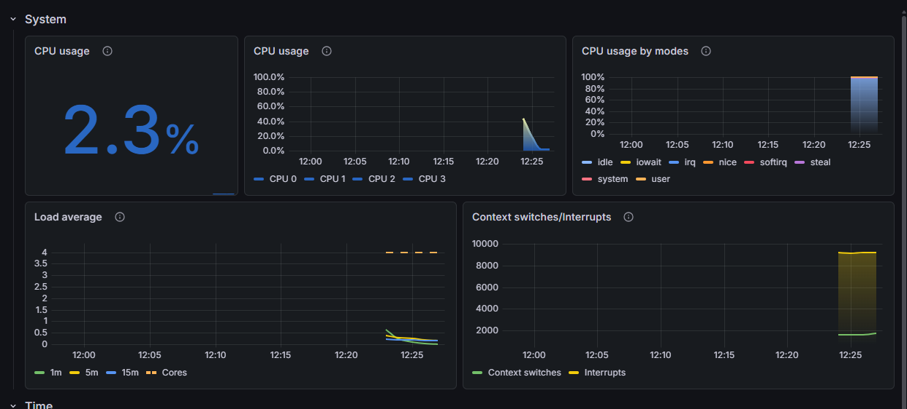

# Todo List – Server Setup

> **Projekt:** Todo List für die Berufsschule  
> **Entwickler:** Maik Burgdorf

---

## Inhaltsverzeichnis

1. [Statische IP festlegen](#1-statische-ip-festlegen)
2. [Benutzer anlegen](#2-benutzer-anlegen)
3. [SSH-Dienst installieren & konfigurieren](#3-ssh-dienst-installieren--konfigurieren)
4. [SSH-Zugriff einschränken](#4-ssh-zugriff-einschränken)
5. [Docker installieren & konfigurieren](#5-docker-installieren--konfigurieren)
6. [Todo-Listen-Anwendung deployen](#6-todo-listen-anwendung-deployen)
7. [Zugriff auf die API](#7-zugriff-auf-die-api)
8. [Nützliche Docker-Befehle](#8-nützliche-docker-befehle)
9. [Bonusaufgabe 1: Grafana Cloud Monitoring](#bonusaufgabe-server-monitoring-mit-grafana-cloud)
10. [Bonusaufgabe 2: Firewall mit ufw](#bonusaufgabe-2-firewall-mit-ufw)

---

## 1. Statische IP festlegen

**Ziel:** IP-Adresse von `192.168.24.137` auf `192.168.24.105` ändern.

1. Verbindungsnamen ermitteln:

   ```bash
   nmcli connection show
   ```

2. Statische IP konfigurieren (Verbindungsname und IP ggf. anpassen):

   ```bash
   
   sudo nmcli connection modify netplan-eth0 \
   ipv4.addresses 192.168.24.105/24 \
   ipv4.gateway 192.168.24.254 \
   ipv4.dns "192.168.24.254" \
   ipv4.method manual

   ```

3. Änderung aktivieren:
   
   ```bash
   sudo nmcli connection down netplan-eth0
   ```


   ```bash
   sudo nmcli connection up netplan-eth0
   ```

> **Hinweis:** Für diesen Schritt werden `sudo`-Rechte benötigt.

---

## 2. Benutzer anlegen

### 2.1 Benutzer `willi`

```bash
sudo adduser willi
```

- Passwort vergeben (in unserem Fall: `1234`)
- Dem Dialog folgen und am Ende mit **Y** bestätigen

### 2.2 Benutzer `fernzugriff`

```bash
sudo adduser fernzugriff
```

- Passwort vergeben (in unserem Fall: `12345`)
- Dem Dialog folgen und am Ende mit **Y** bestätigen

### 2.3 Sudo-Rechte für `fernzugriff` vergeben

```bash
sudo usermod -aG sudo fernzugriff
```

Prüfung:

```bash
groups fernzugriff
```

> Erwartete Ausgabe: Die Gruppe `sudo` ist aufgelistet.

---

## 3. SSH-Dienst installieren & konfigurieren

### 3.1 Paket installieren

```bash
sudo apt update
sudo apt install openssh-server -y
```

### 3.2 Dienst starten und dauerhaft aktivieren

```bash
sudo systemctl enable ssh
sudo systemctl start ssh
```

### 3.3 Status prüfen

```bash
sudo systemctl status ssh
```

> Erwartete Ausgabe enthält `enabled` und `active (running)`.

---

## 4. SSH-Zugriff einschränken

Nur der Benutzer `fernzugriff` soll sich per SSH verbinden dürfen.

1. SSH-Konfiguration öffnen:

   ```bash
   sudo nano /etc/ssh/sshd_config
   ```

2. Am Ende der Datei folgende Zeile hinzufügen:

   ```
   AllowUsers fernzugriff
   ```

3. SSH-Dienst neu starten, damit die Änderung greift:

   ```bash
   sudo systemctl restart ssh
   ```

---

## Zusammenfassung

| Benutzer | Passwort | Sudo | SSH-Zugang |
|----------|----------|------|------------|
| `willi` | `1234` | ❌ | ❌ |
| `fernzugriff` | `12345` | ✅ | ✅ |

Der Server ist nun unter der statischen IP `192.168.24.105` erreichbar. Ausschließlich der Benutzer `fernzugriff` kann sich per SSH verbinden und verfügt über administrative Rechte.

---

## 5. Docker installieren & konfigurieren

### 5.1 System aktualisieren

Vor der Docker-Installation sollten alle Pakete auf den neuesten Stand gebracht werden:

```bash
sudo apt-get update && sudo apt-get upgrade -y
```

### 5.2 Docker installieren

```bash
sudo apt install docker.io -y
```

### 5.3 Docker-Dienst starten und aktivieren

```bash
sudo systemctl enable docker.service
sudo systemctl start docker.service
```

### 5.4 Installation testen

**Test: Hello-World-Container**

```bash
sudo docker run hello-world
```

> **Erwartete Ausgabe:** `Hello from Docker!`

---

## 6. Todo-Listen-Anwendung deployen

### 6.1 Projektdateien auf den Raspberry Pi übertragen

Von deinem **lokalen Windows-PC** aus:

```powershell
scp Dockerfile server.py specification.yaml fernzugriff@192.168.24.105:~/todolist/
```

> Die Dateien werden in das Verzeichnis `~/todolist/` auf dem Raspberry Pi kopiert.

### 6.2 Docker-Image bauen

Per SSH auf dem Raspberry Pi einloggen:

```powershell
ssh fernzugriff@192.168.24.105
```

In das Projektverzeichnis wechseln und das Docker-Image erstellen:

```bash
cd ~/todolist
sudo docker image build -t todolist-webapp .
```

### 6.3 Container starten

```bash
sudo docker run -d -p 5000:5000 --name todolist todolist-webapp
```

**Parameter-Erklärung:**
- `-d`: Container läuft im Hintergrund (detached mode)
- `-p 5000:5000`: Port-Weiterleitung (Host:Container)
- `--name todolist`: Vergabe eines Container-Namens
- `todolist-webapp`: Name des Images

---

## 7. Zugriff auf die API

Die Todo-Listen-API ist nun von jedem Gerät im Netzwerk erreichbar:

**Basis-URL:**
```
http://192.168.24.105:5000/
```

**Beispiel-Anfrage:**

**Alle Einträge einer Liste abrufen:**
   ```
   GET http://192.168.24.105:5000/todo-list/1318d3d1-d979-47e1-a225-dab1751dbe75
   ```

---

## 8. Nützliche Docker-Befehle

#### Gegenbenenfalls muss `sudo` vor den Befehlen ergänzt werden.

| Befehl | Beschreibung |
|--------|--------------|
| `docker ps` | Zeigt laufende Container |
| `docker ps -a` | Zeigt alle Container (auch gestoppte) |
| `docker stop todolist` | Stoppt den Container |
| `docker start todolist` | Startet den Container |
| `docker restart todolist` | Startet den Container neu |
| `docker logs todolist` | Zeigt Container-Logs |
| `docker rm todolist` | Löscht den Container (muss gestoppt sein) |
| `docker images` | Zeigt alle Images |
| `docker rmi todolist-webapp` | Löscht das Image |

---

## Bonusaufgabe: Server-Monitoring mit Grafana Cloud

### Ziel

Den Raspberry Pi mit **Grafana Cloud** überwachen, um Systemressourcen (CPU, RAM, Disk, Netzwerk) in Echtzeit im Browser einsehen zu können.

---

### 9.1 Grafana Cloud Account erstellen

1. Auf [grafana.com](https://grafana.com/) registrieren (E-Mail & Passwort)
2. E-Mail mit Bestätigungscode verifizieren
3. Region auswählen → **EU**

---

### 9.2 Grafana Alloy Agent installieren

Im Grafana Cloud Portal den **Getting Started Guide** durchklicken:

1. **„Monitor my OS"** auswählen
2. Konfiguration:
   - **Architektur:** `Arm64`
   - **Plattform:** `Debian`
3. **Token Name** festlegen → `todolist-webapp-token`
4. Grafana generiert einen Installations-Befehl – diesen auf dem Raspberry Pi ausführen:

   ```bash
   ssh fernzugriff@192.168.24.105
   ```

   ```bash
   # Den von Grafana generierten Befehl hier einfügen und ausführen
   # (enthält API-Key und Endpoint – nicht öffentlich teilen!)
   ```

> **Hinweis:** Der generierte Befehl installiert den **Grafana Alloy Agent**, der Metriken sammelt und an Grafana Cloud sendet.

---

### 9.3 Verbindung testen

Nach Abschluss der Installation im Grafana Cloud Portal auf **„Test Connection"** klicken.

✅ Bei erfolgreicher Verbindung wird der Raspberry Pi als Datenquelle erkannt.

---

### 9.4 Dashboard einrichten

1. Im Portal ein vorkonfiguriertes Dashboard auswählen
2. Gewählt: **„CPU & System"**
3. Das Dashboard zeigt u. a.:
   - CPU-Auslastung (User, System, Idle)
   - Arbeitsspeicher-Nutzung
   - Festplatten-I/O
   - System-Uptime

**Screenshot des Dashboards:**



---

### 9.5 Alloy Agent Status prüfen

Falls die Verbindung nicht funktioniert, kann der Agent-Status geprüft werden:

```bash
sudo systemctl status alloy
```

Neustart des Agents:

```bash
sudo systemctl restart alloy
```

---

## Bonusaufgabe 2: Firewall mit ufw

### Ziel

Den Server nach dem **Whitelist-Prinzip** absichern: Alles wird blockiert, nur explizit erlaubte Ports dürfen passieren.

### Benötigte Ports

| Dienst | Port | Protokoll | Richtung |
|--------|------|-----------|----------|
| SSH | `22` | TCP | eingehend |
| Todo-API (Docker) | `5000` | TCP | eingehend |
| Grafana Alloy | – | – | nur ausgehend, kein Port nötig |

---

### 10.1 ufw installieren

```bash
sudo apt update
sudo apt install ufw -y
```

---

### 10.2 Standardregeln setzen (Whitelist-Prinzip)

```bash
sudo ufw default deny incoming
sudo ufw default allow outgoing
```

> Damit wird **jede eingehende Verbindung blockiert**, sofern sie nicht explizit erlaubt wird.

---

### 10.3 Ausnahmen für notwendige Dienste

**SSH (Port 22):**
```bash
sudo ufw allow 22/tcp
```

**Todo-API (Port 5000):**
```bash
sudo ufw allow 5000/tcp
```

---

### 10.4 Firewall aktivieren

```bash
sudo ufw enable
```

> Bei der Abfrage mit **Y** bestätigen.

Status prüfen:

```bash
sudo ufw status verbose
```

✅ Erwartete Ausgabe:
```
Status: active
Default: deny (incoming), allow (outgoing)
To                         Action      From
--                         ------      ----
22/tcp                     ALLOW IN    Anywhere
5000/tcp                   ALLOW IN    Anywhere
```

---

### 10.5 Docker und ufw

**Ausgangssituation:** Docker manipuliert `iptables` direkt und **umgeht dabei ufw-Regeln**. Ein per Docker freigegebener Port ist auch dann von außen erreichbar, wenn ufw ihn nicht explizit erlaubt.

**Lösung:** In `/etc/docker/daemon.json` eintragen, dass Docker die `iptables`-Regeln nicht selbst verwaltet:

```bash
sudo nano /etc/docker/daemon.json
```

Folgenden Inhalt einfügen (oder ergänzen):

```json
{
  "iptables": false
}
```

Danach Docker neu starten:

```bash
sudo systemctl restart docker
```

> **Achtung:** Nach dieser Änderung übernimmt ufw die volle Kontrolle über den Docker-Traffic. Sicherstellen, dass Port `5000` in ufw freigegeben ist, bevor Docker neu gestartet wird.